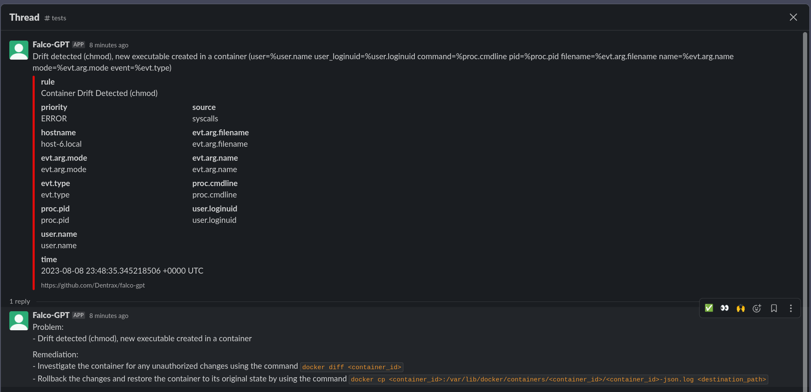

<p align="center"><a href="https://github.com/Dentrax/falco-gpt" target="_blank"></a></p>

<h1 align="center">falco-gpt</h1>

<div align="center">
 <strong>
   falco-gpt is an OpenAI powered tool to generate remediation actions for Falco audit events
 </strong>
</div>

<br />

<p align="center">
  <a href="https://opensource.org/licenses/MIT"></a>
  <a href="https://github.com/Dentrax/falco-gpt/releases/latest"></a>
  <a href="https://goreportcard.com/report/github.com/Dentrax/falco-gpt"></a>
</p>

<br />

`falco-gpt` is an OpenAI powered tool to generate remediation actions for Falco audit events. It is a simple HTTP server
that listens for Falco audit events and pushes them to an internal NATS server acting like a queue. The queue is then
processed by a goroutine that sends the audit events to OpenAI API by applying rate limiting and retries. The generated
remediation actions are then sent to Slack via a BOT in a thread.

# Screenshots



# Features

* OpenAI powered
* Async processing
* Resiliency with retries
* Rate limiting (queries per hour)
* Custom prompt template
* Limitation: Only Slack support for demo purposes

# High Level Overview

```bash
                              +------------------------------------------------------+
                              |                                                      |
                              |                                        +----------+  |
                              |                             +--------->|          |  |
                              |                             |          |  OpenAI  |  |
+-------------+               | +-------------+       +-----+-------+  |    API   |  |
|             |               | |             |       |  Retryable  |<-+          |  |
|    falco    |  Send audits  | |  falco-gpt  |Push To| Rate-Limited|  +----------+  |
|  instances  +-------------->| | HTTP Server +------>|    Async    |                |
|(http_output)|    [POST]     | |   (:8080)   |Buffer |    Queue    |  +----------+  |
|             |               | |             |       |  Processor  |  |          |  |
+-------------+               | +-------------+       +------+------+  |  Slack   |  |
                              |                              |         |   BOT    |  |
                              |                              +-------->|          |  |
                              |                                        +----------+  |
                              |                                                      |
                              +------------------------------------------------------+
```

# Installation

## Prerequisites

1. Export the following environment variables:

- [OPENAI_TOKEN](https://platform.openai.com/account/api-keys)
- [SLACK_TOKEN](https://api.slack.com/authentication/token-types#bot)

2. [Falco](https://falco.org/docs/getting-started/installation/) with `http_output` enabled:

```bash
helm upgrade --install falco falcosecurity/falco --namespace falco --create-namespace \
  --set falco.json_output=true \
  --set falco.http_output.enabled=true \
  --set falco.http_output.url=http://falco-gpt:8080
```

## Build

### Build with [go](https://golang.org/)

```bash
go build .
```

### Build with [ko](https://github.com/ko-build/ko/)

```bash
KO_DOCKER_REPO=<REGISTRY> LDFLAGS="-s -w" ko publish -B --platform=linux/amd64 --tags latest --push=true .
````

## Deployment

Container Image:
```bash
furkanturkal/falco-gpt:latest
```

### Kubernetes

```bash
envsubst < deployment.yaml | kubectl apply -n falco -f -
```

# Usage

```bash
$ go run . <FLAGS>

  -channel string
        Slack channel
  -ignore-older int
        Ignore events in queue older than X hour(s) (default 1)
  -min-priority string
        minimum priority to analyse (default "warning")
  -model string
        Backend AI model (default "gpt-3.5-turbo")
  -port int
        port to listen on (default 8080)
  -qph int
        max queries per HOUR to OpenAI (default 10)
  -template-file string
        path custom template file to use for the ChatGPT
```

# Disclaimer

Your audit log payloads will be sent to OpenAI to generate remediation actions. This project currently does not
anonymize the audit log payloads. Please be aware of this when using this tool if you are concerned about your sensitive
data. Use at your own risk. By using this tool, you agree that you are solely responsible for any and all consequences;
and
that the author(s) of this tool are not liable for any damages or losses of any kind.

# License

*falco-gpt* was created by [Furkan 'Dentrax' Türkal](https://twitter.com/furkanturkaI)

The base project code is licensed under [MIT](https://opensource.org/licenses/MIT) unless otherwise specified. Please
see the **[LICENSE](https://github.com/Dentrax/falco-gpt/blob/main/LICENSE)** file for more information.

<kbd>Best Regards</kbd>
