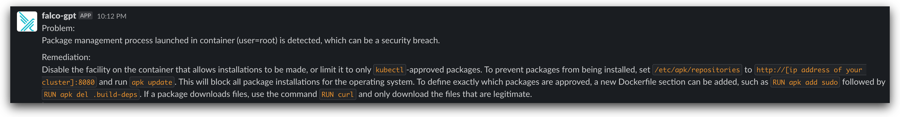

<p align="center"><a href="https://github.com/Dentrax/falco-gpt" target="_blank"></a></p>

<h1 align="center">falco-gpt</h1>

<div align="center">
 <strong>
   `falco-gpt` is an OpenAI powered tool to generate remediation actions for Falco audit events
 </strong>
</div>

<br />

<p align="center">
  <a href="https://opensource.org/licenses/MIT"></a>
  <a href="https://github.com/Dentrax/falco-gpt/releases/latest"></a>
  <a href="https://goreportcard.com/report/github.com/Dentrax/falco-gpt"></a>
</p>

<br />

# Screenshots





# High Level Overview

```bash
                              +------------------------------------------------------+
                              |                                                      |
                              |                                        +----------+  |
                              |                             +--------->|          |  |
                              |                             |          |  OpenAI  |  |
+-------------+               | +-------------+       +-----+-------+  |    API   |  |
|             |               | |             |       |  Retryable  |<-+          |  |
|    falco    |  Send audits  | |  falco-gpt  |Push To| Rate-Limited|  +----------+  |
|  instances  +-------------->| | HTTP Server +------>|    Async    |                |
|(http_output)|    [POST]     | |   (:8080)   |Buffer |    Queue    |  +----------+  |
|             |               | |             |       |  Processor  |  |          |  |
+-------------+               | +-------------+       +------+------+  |  Slack   |  |
                              |                              |         | Webhook  |  |
                              |                              +-------->|          |  |
                              |                                        +----------+  |
                              |                                                      |
                              +------------------------------------------------------+
```

# Installation

## Prerequisites

1. Export the following environment variables:

- [$OPENAI_TOKEN](https://platform.openai.com/account/api-keys)
- [$SLACK_WEBHOOK_URL](https://api.slack.com/messaging/webhooks)

2. [Falco](https://falco.org/docs/getting-started/installation/) with `http_output` enabled:

```bash
helm upgrade --install falco falcosecurity/falco --namespace falco --create-namespace \
  --set falco.json_output=true \
  --set falco.http_output.enabled=true \
  --set falco.http_output.url=http://falco-gpt:8080
```

## Deploy to Kubernetes

```bash
envsubst < deployment.yaml | kubectl apply -f -
```

# Usage

```bash
$ go run . <FLAGS>

-buffer int
    falco log buffer size (default 1000)
-min-priority string
    minimum priority to analyse (default "warning")
-model string
    Backend AI model (default "gpt-3.5-turbo")
-port int
    port to listen on (default 8080)
-qps int
    queries per HOUR to OpenAI and Slack (default 10)
-template-file string
    path custom template file to use for the ChatGPT
```

# License

*falco-gpt* was created by [Furkan 'Dentrax' Türkal](https://twitter.com/furkanturkaI)

The base project code is licensed under [MIT](https://opensource.org/licenses/MIT) unless otherwise specified. Please see the **[LICENSE](https://github.com/Dentrax/falco-gpt/blob/main/LICENSE)** file for more information.

<kbd>Best Regards</kbd>
